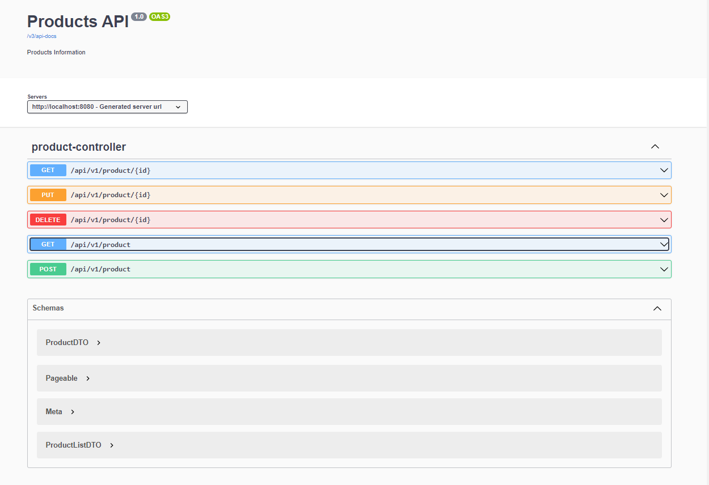

# **Products MS API**

A RESTful API for retrieving and managing product information.

## Technologies

- Java 11
- MongoDB
- Docker

## **Endpoints**

### **Get Product Details by ID**

- URL: **`/api/v1/product/{id}`**
- Method: **`GET`**
- URL parameters:
    - id: string (required)
- Responses:
    - 200 OK: returns a product object

### **Update Product by ID**

- URL: **`/api/v1/product/{id}`**
- Method: **`PUT`**
- URL parameters:
    - id: string (required)
- Request Body:
    - content-type: application/json
    - schema: **`ProductDTO`** (as defined in **`components/schemas`**)
- Responses:
    - 200 OK: returns a product object

### **Delete Product by ID**

- URL: **`/api/v1/product/{id}`**
- Method: **`DELETE`**
- URL parameters:
    - id: string (required)
- Responses:
    - 200 OK: returns an empty object

### **Get Product List**

- URL: **`/api/v1/product`**
- Method: **`GET`**
- URL parameters:
    - pageable: object (required)
- Responses:
    - 200 OK: returns a product list object (as defined in **`components/schemas/ProductListDTO`**)

### **Create Product**

- URL: **`/api/v1/product`**
- Method: **`POST`**
- Request Body:
    - content-type: application/json
    - schema: **`ProductDTO`** (as defined in **`components/schemas`**)
- Responses:
    - 201 Created: returns a product object

## **Components**

The API specification includes the following components:

- **`ProductDTO`**: object representing a product, with properties **`name`** (string) and **`description`** (string) as required fields.
- **`ProductListDTO`**: object representing a list of products, as defined in the **`$ref`** property.

## **Server**

- URL: **`http://localhost:8080`**
- Description: Generated server url

## **Version**

1.0

## **OpenAPI specification version**

3.0.1